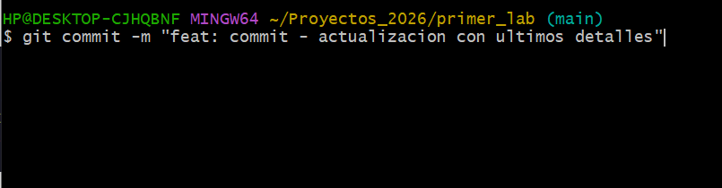
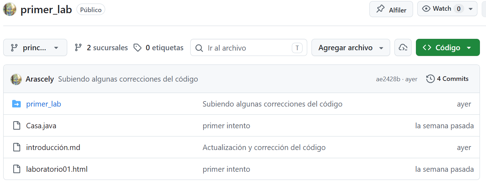
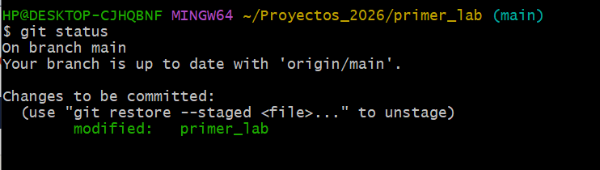
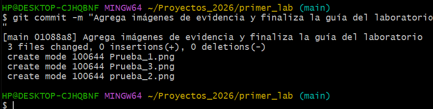

# Guía de uso para Git Bash

<div style="background-color: #f1f8e9; border-left: 6px solid #a1887f; padding: 20px; border-radius: 10px; margin-bottom: 25px;">
    <h2 style="color: #4e342e; margin-top: 0; font-size: 1.4em;">Presentación</h2>
    <p style="font-size: 0.85em; color: #5d4037; line-height: 1.6; margin-bottom: 0;">
        Soy <b>Grissel Arascely Rodríguez Quispe</b>, estudiante de Ingeniería de Sistemas en la UNSCH. <br><br>
        Hice este instructivo para dominar las bases de Git, una herramienta fundamental en nuestra formación profesional.
    </p>
</div>

### Herramientas Utilizadas
Para el desarrollo de esta práctica, se emplearon las siguientes herramientas:
* **Git Bash:** Como terminal o línea de comandos principal.
* **GitHub:** Como plataforma de alojamiento para el repositorio remoto.
* **Editor de texto / IDE:** VS Code

## 1. Configuración de Identidad

Antes de realizar cualquier cambio, es vital asegurarte de que Git sepa quién eres.

### Corroborar sesión actual
Se usa estos comandos para verificar si tu nombre y correo ya están configurados:
```bash
git config user.name
git config user.email
```

### Iniciar sesión o Cambiar usuario
```bash
git config --global user.name "Tu Nombre"
git config --global user.email "tu@email.com"
```

---

## 2. Flujo de Trabajo Inicial

### Inicializar proyecto
```bash
git init
```

### Preparar archivos (`git add`)
Para agregar todo el contenido del directorio:
```bash
git add .
```
Para agregar un archivo específico:
```bash
git add nombre-archivo.txt
```

### Confirmar cambios (`git commit`)
```bash
git commit -m "Mensaje descriptivo del cambio"
```

---

## 3. Comandos esenciales

| Comando | Acción |
| :--- | :--- |
| `git status` | Muestra el estado actual: archivos nuevos, modificados o listos para commit. |
| `git log --oneline` | Visualiza el historial de commits de manera resumida y elegante. |
| `git branch` | Muestra en qué rama te encuentras actualmente. |
| `git remote -v` | Verifica si tu repositorio local está conectado a uno remoto (GitHub/GitLab). |
| `git checkout -b [nombre]` | Crea una nueva rama y te cambia a ella automáticamente. |

---

## 4. Ejemplo practico de como funciona
```bash
# 1. Iniciar repositorio
- git init

# 2. Configurar identidad (si no lo hiciste antes)
- git config --global user.name "Tu Nombre"
- git config --global user.email "tu@email.com" 

# 3. Crear y agregar un archivo
- echo "# Mi Proyecto" > README.md
- git add README.md
- git commit -m "Primer commit: agrega README"

# 4. Crear nueva rama para trabajar sin afectar la principal
- git checkout -b desarrollo

# 5. Verificar estado general
- git status
- git branch
```
## 5. Solución a Errores Comunes

Durante el aprendizaje, es completamente normal toparse con errores en la terminal. Aquí tienes la solución a los más frecuentes:

### Error: `bash: cd: too many arguments`
* **Por qué pasa:** Intentaste entrar a una carpeta que tiene espacios en su nombre (por ejemplo: `Proyectos 2026`) y Git Bash se confunde, pensando que le estás dando dos rutas diferentes.

* **Solución:** Siempre que una ruta tenga espacios, enciérrala entre comillas.
```bash
cd "C:/Ruta/A/Tus Proyectos/primer_lab"
```

### Error: `src refspec main does not match any` al hacer push
* **Por qué pasa:** Estás intentando subir tu código a la rama `main` en GitHub, pero Git detecta que en tu computadora estás trabajando en la rama antigua llamada `master`.
* **Solución:** Simplemente renombra tu rama local a `main` para que coincidan y vuelve a intentar subirlo.
```bash
git branch -m master main
```

## 6. Evidencias y Resultados

A continuación, se presentan las capturas de pantalla que validan la ejecución correcta de los comandos y la sincronización con el repositorio remoto:

### Historial de Commits en Local
*(Captura de la terminal ejecutando el comando `git log --oneline` o mostrando tu commit final)*


### Repositorio en GitHub
*(Captura del repositorio `primer_lab` a la cuenta de GitHub con las correcciones)*


### Verificación del Estado del Repositorio
*(En la siguiente captura se demuestra el uso del comando `git status` para verificar la rama actual, la conexión con el repositorio remoto y los archivos preparados para el próximo commit).*

 ## Última prueba


<div style="background-color: #fff8e1; border-left: 6px solid #ffb74d; padding: 15px; border-radius: 10px; margin-top: 30px;"> 
    <p style="font-size: 0.8em; color: #e65100; margin: 0; text-align: center;"> 
         <strong>Recordar:</strong> Git como una gran herramienta es algo que debemos aprender, esta practica se hizo con el objetivo de saber como se usa git y poder usarlo posteriormente en el futuro como una guía personal.
    </p> 
</div>